# TP-SDI

Trabajo Práctico Grupo 3 - Materia Sistemas Distribuidos I - FIUBA

## 📚 Índice

1. [📘 Descripción General](#tp-sdi)  
2. [✅ Requerimientos](#-requerimientos)  
   - [Funcionales](#funcionales)  
   - [No funcionales](#no-funcionales)  
     - [📈 Escalabilidad](#-escalabilidad)  
     - [👥 Multi-client](#-multi-client)  
     - [🛡️ Tolerancia a fallos](#️-tolerancia-a-fallos)  
3. [🛠️ Configuración del Sistema](#️-configuración-del-sistema)  
   - [⚙️ Configurar cantidad de nodos](#️-configurar-cantidad-de-nodos)  
   - [🔧 Generar los `docker-compose`](#-generar-los-docker-compose)  
     - [📦 Instalar dependencias](#-instalar-dependencias)  
     - [✅ Script auxiliar `generate-compose.sh`](#-script-auxiliar-generate-composesh)  
     - [📌 Parámetros](#-parámetros)  
     - [📖 Ejemplos](#-ejemplos)  
     - [📋 Preparar datasets de prueba](#-preparar-datasets-de-prueba)  
4. [▶️ Correr el sistema](#️-correr-el-sistema)  
5. [🧱 Comandos disponibles (`Makefile`)](#-comandos-disponibles-makefile)  
6. [💀 Introducción de fallas)](#-introducción-de-fallas)
7. [📊 Monitoreo de las colas (RabbitMQ)](#-monitoreo-de-las-colas-rabbitmq)
8. [💯 Respuestas esperadas](#-respuestas-esperadas)  
9. [🛠️ Construido con](#️-construido-con)  
10. [✒️ Autores](#️-autores)  
11. [📑 Documentación](#-documentación)

---

## ✅ Requerimientos

### Funcionales

- Se solicita un sistema distribuido que analice la información de películas y los ratings de sus espectadores en plataformas como iMDb.
- Los ratings son un valor numérico de 1 al 5. Las películas tienen información como género, fecha de estreno, países involucrados en la producción, idioma, presupuesto e ingreso.
- Se debe obtener:
    1. Películas y sus géneros de los años 2000 con producción Argentina y Española.
    2. Top 5 de países que más dinero han invertido en producciones sin colaborar con otros países.
    3. Película de producción Argentina estrenada a partir del 2000, con mayor y con menor promedio de rating.
    4. Top 10 de actores con mayor participación en películas de producción Argentina con fecha de estreno posterior al 2000.
    5. Promedio de la tasa ingreso/presupuesto de películas con overview de sentimiento positivo vs. negativo.

### No funcionales

#### 📈 Escalabilidad

- El sistema debe estar optimizado para entornos multicomputadoras.
- Debe soportar el escalado horizontal al incrementar nodos de cómputo.
- Se requiere el desarrollo de un Middleware para abstraer la comunicación basada en grupos.
- Debe soportar una única ejecución del procesamiento y permitir un *graceful quit* ante señales `SIGTERM`.

#### 👥 Multi-client

- Soporte para varias ejecuciones de las consultas por parte de un cliente, sin reinicio del servidor.
- Ejecución con varios clientes de forma concurrente.
- Correcta limpieza de los recursos luego de cada ejecución.

#### 🛡️ Tolerancia a fallos

- El sistema debe ser tolerante a fallos por caídas de procesos.
- En caso de usar un algoritmo de consenso, el mismo tiene que ser implementado por los alumnos.
- Está permitido utilizar [docker-in-docker](https://github.com/7574-sistemas-distribuidos/docker-from-docker) para levantar procesos caídos
- No está permitido utilizar docker para verificar si un nodo está disponible.

---

## 🛠️ Configuración del Sistema

### ⚙️ Configurar cantidad de nodos

Antes de generar el archivo `docker-compose.system.yml`, podés editar el archivo`global_config.ini` para ajustar la cantidad de nodos que tendrá cada componente del sistema:

```ini
[DEFAULT]
gateway_nodes = 1
cleanup_filter_nodes = 2
production_filter_nodes = 2
year_filter_nodes = 2
sentiment_analyzer_nodes = 5
join_credits_nodes = 2
join_ratings_nodes = 3
```

---

### 🔧 Generar los `docker-compose`

Se cuenta con un script auxiliar para facilitar la generación de los archivos `docker-compose.system.yml` y `docker-compose.clients.yml` de manera dinámica, según los parámetros que se definan.

---

#### 📦 Instalar dependencias

Antes de ejecutar cualquier script Python, asegurate de instalar las dependencias necesarias:

```bash
pip install -r requirements.txt
```

---

#### ✅ Script auxiliar `generate-compose.sh`

```bash
./generate-compose.sh [<output_file.yml>] [-test <test_config.yaml>] [-cant_clientes N]
```

---

#### 📌 Parámetros

- `<output_file.yml>`: Opcional. Nombre base del archivo de salida. En caso de no pasarse, será: `docker-compose.system.yaml` para el sistema y `docker-compose.clients.yml` para los clientes.
- `-test <test_config.yaml>`: Opcional. Monta datasets reducidos para pruebas rápidas y ejecuta automáticamente `download_datasets.py -test <test_config.yaml>`, con la configuración seteada en:`test_config.yaml` (para más información sobre como configurar el set de pruebas vaya a [📋 Preparar datasets de prueba](#-preparar-datasets-de-prueba)). En caso de no pasarse, se descargaran los datasets completos.
- `-cant_clientes N`: Opcional. Define cantidad de clientes (client_X) que se generan. En caso de no pasarse se generará 1 solo cliente.

---

#### 📖 Ejemplos

- Generar configuración default:

```bash
./generate-compose.sh
```

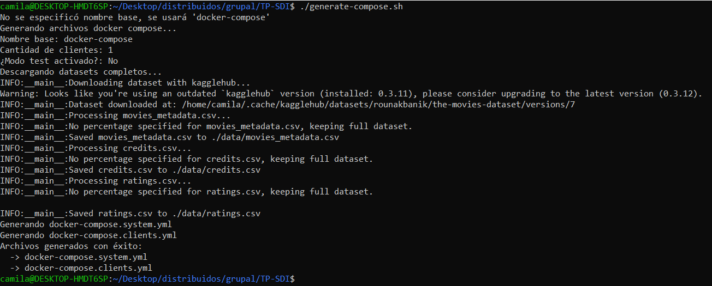

- Generar en modo test:

```bash
./generate-compose.sh -test test_config.yaml
```

- Generar con 4 clientes:

```bash
./generate-compose.sh -cant_clientes 4
```

- Combinar ambos:

```bash
./generate-compose.sh -test test_config.yaml -cant_clientes 10
```

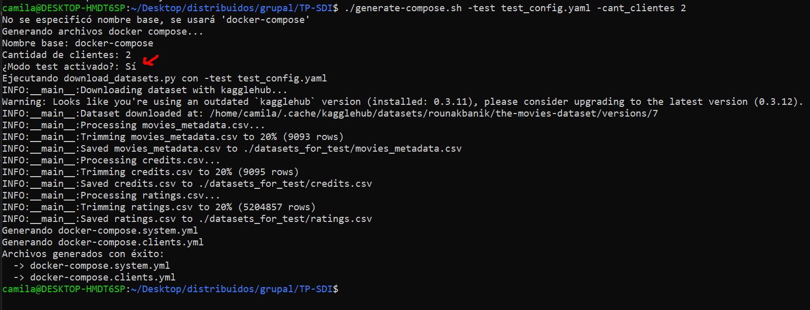

> Nota: Si ya tienes desacrgados los datasets, puedes correr el flag `-skip_download`para saltear la descarga de los datasets
>
>```bash
> ./generate-compose.sh -skip_download
>```

---

### 📋 Preparar datasets de prueba

Con correr el flag `-test`en el script anterior ya queda seteado, pero se puede correr por separado con el comando:

```bash
python3 download_datasets.py [-test <test_config.yaml>]
```

- Por defecto descarga el dataset completo desde Kaggle.
- Si se pasa el flag `-test`, los archivos se recortan según los porcentajes definidos en el YAML.
- Los archivos se guardan en la carpeta `./data`.

**Ejemplo de `test_config.yaml` con todos los datasets al 20%:**

```yaml
movies_metadata.csv: 20
credits.csv: 20
ratings.csv: 20
```

---

### ▶️ Correr el sistema

> [!IMPORTANT]
> **Pre-requisito**: Asegurate de tener generados los archivos `docker-compose.system.yaml` para el sistema y `docker-compose.clients.yml`para los clientes. Para más información sobre como generarlos, consultá la sección [✅ Script auxiliar `generate-compose.sh`](#-script-auxiliar-generate-composesh))

---

#### 🖥️ Organización recomendada

Para facilitar el desarrollo y la depuración, se recomienda levantar los servicios en **dos consolas separadas**:

- Una consola para todo lo relacionado con el **sistema** (gateway, coordinator, filtros, joins, querys, etc.).
- Otra consola para levantar y monitorear a los **clientes**.

---

### 🧱 Comandos disponibles (`Makefile`)

#### 🧹 Limpiar resultados anteriores

```bash
sudo rm -rf ./resultados/*./gateway/storage/*
```

#### ⚙️ Build de imágenes

```bash
make build-system     # Construye las imágenes del sistema
make build-clients    # Construye las imágenes de los clientes
```

#### 🚀 Levantar contenedores

```bash
make up-system        # Levanta solo los servicios del sistema
make up-clients       # Levanta solo los servicios de los clientes
```

> 💡 Recordá correr `make up-system` **antes** de `make up-clients`, y esperar a que todos los servicios estén saludables / healthy.

#### 📜 Ver logs

```bash
make logs-system      # Muestra logs del sistema (gateway, coordinator, filters, joiners, querys, etc.)
make logs-clients     # Muestra logs de los clientes
make logs-all         # Muestra todos los logs combinados (sistema + clientes)
```

> Tip: Dejá `logs-system` corriendo en una terminal para monitorear la actividad mientras los clientes interactúan.

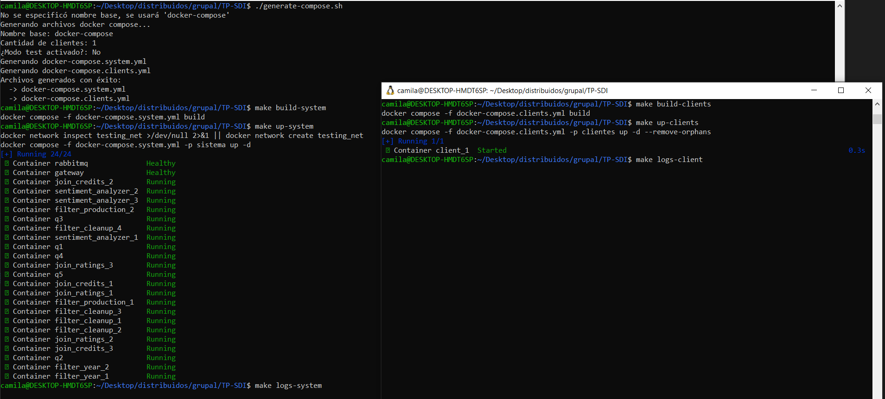

#### 🔻 Apagar o limpiar

```bash
make down             # Detiene todos los servicios (sistema + clientes)
make clean            # Elimina contenedores, redes y volúmenes
make ps               # Lista los contenedores activos relacionados
```

#### 🛑 Detener con `SIGTERM` (graceful shutdown)

```bash
make docker-kill-system   # Detiene solo los contenedores del sistema con SIGTERM
make docker-kill-clients  # Detiene solo los contenedores de los clientes con SIGTERM
```

---

## 💀 Introducción de fallas

Para probar la tolerancia a fallos, se cuenta con un script para testear la resiliencia del sistema a la caída de los nodos: gateway, filter_cleanup, filter_year, filter_production, sentiment_analyzer, join_credits y join_ratings.

```bash
./fault_injector.sh
```

---

## 📊 Monitoreo de las colas (RabbitMQ)

Podés visualizar el estado de las **queues** y monitorear la actividad del sistema accediendo al panel de administración de **RabbitMQ** desde tu navegador:

🔗 [http://localhost:15672/#/queues](http://localhost:15672/#/queues)

- **Usuario**: `guest`  
- **Contraseña**: `guest`

Desde este panel vas a poder inspeccionar los mensajes en las colas, ver estadísticas en tiempo real y comprobar que los workers estén procesando correctamente.

---

## 💯 Respuestas esperadas

### Datasets al 100 %

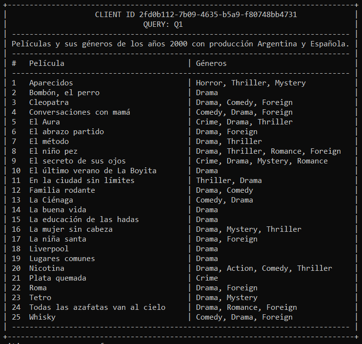
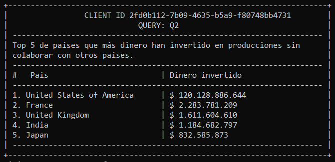
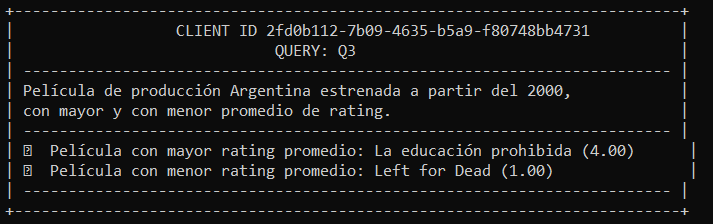
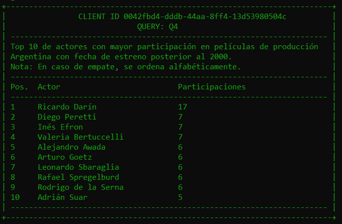
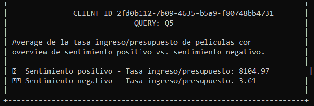

---

### Datasets al 20 %

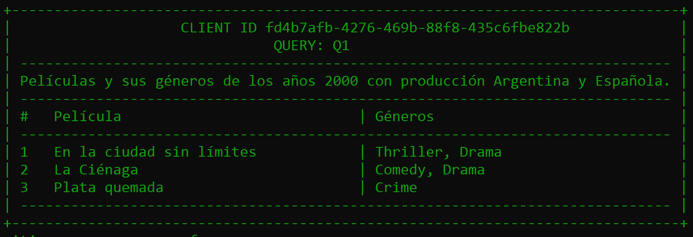
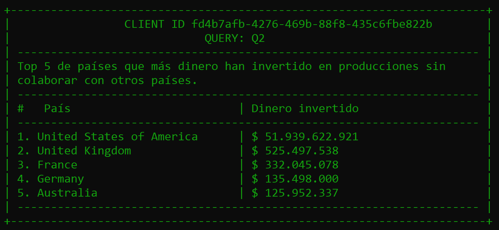
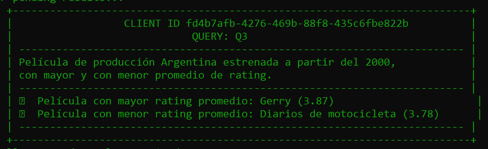

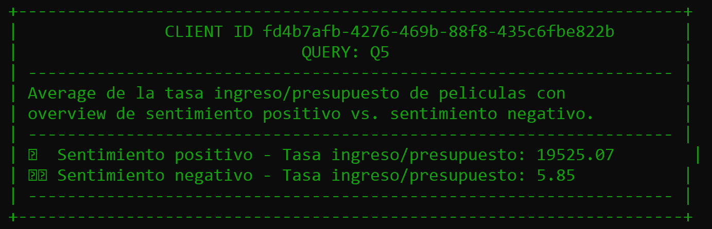

---

## 🛠️ Construido con

- [Python](https://www.python.org/)
- [Docker](https://www.docker.com/)
- [RabbitMQ](https://www.rabbitmq.com/)
- [Makefile](https://www.gnu.org/software/make/manual/make.html)
- [kagglehub](https://github.com/Kaggle/kagglehub)

---

## ✒️ Autores

- **Juan Pablo Fresia** - 102.396 - [JuanPF56](https://github.com/JuanPF56)
- **Nathalia Lucia Encinoza Vilela** - 106.295 - [nathencinoza](https://github.com/nathencinoza)
- **Camila Belén Sebellin** - 100.204 - [camiSebe](https://github.com/camiSebe)

---

## 📑 Documentación

- [Informe](https://docs.google.com/document/d/18aTTPUsk92PdTrNy6LHbvxGXs0G7jUu8EUrdss36D48/edit?usp=sharing)
- [Diagramas](https://drive.google.com/file/d/15dcFuXlb_mMzxmrfxLuxFFdnBSae8ah3/view?usp=sharing)
